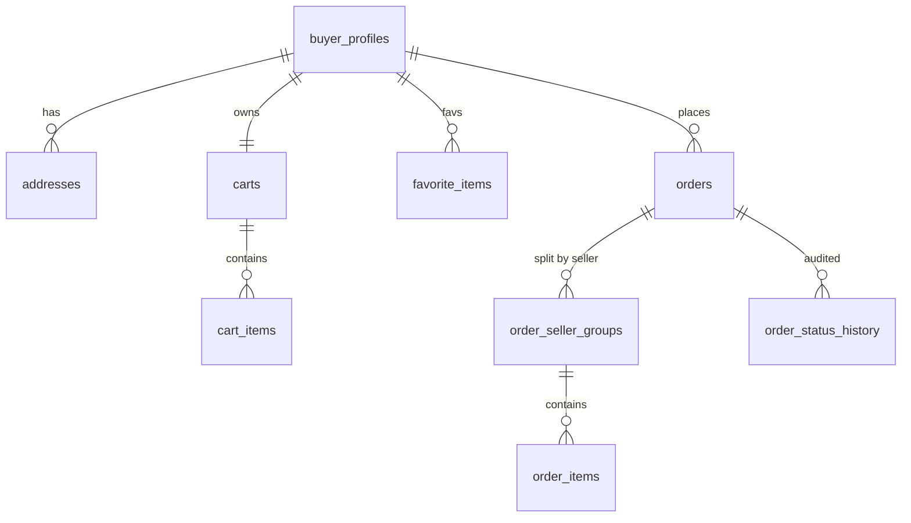
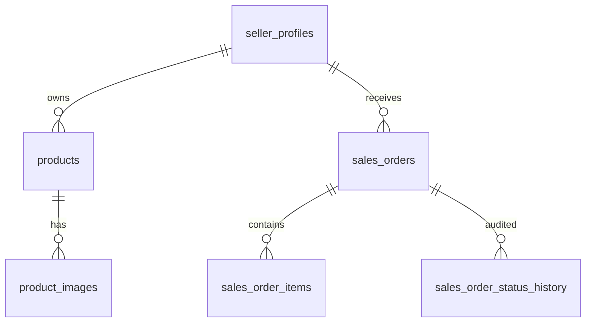
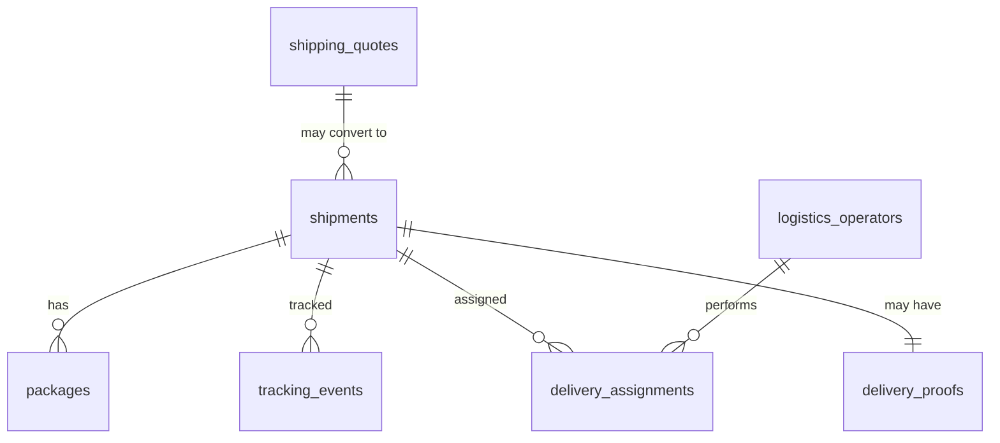
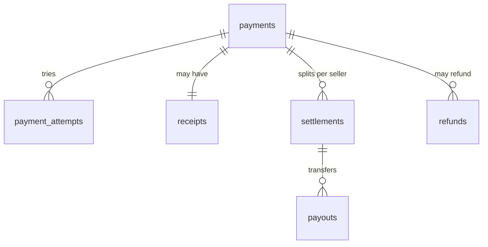

# 1.4 — Modelo de Datos por Aplicación

> **Tipo C — Marketplace · BiciMarket**

---

> **Restricción del proyecto — stock ilimitado**: ninguna DB modela inventario. Seller App no tiene campo `stock` en `products` ni tabla `inventory_movements`. Toda publicación `active` se considera disponible. Ver `01-descripcion.md §1.1`.

## 0. Reglas comunes a todas las DB

- **Motor**: PostgreSQL 16+, una instancia por app (ideal: bases separadas en clusters separados; mínimo aceptable: bases separadas en el mismo cluster con usuarios distintos).
- **ORM**: Prisma.
- **IDs**: `String @id @default(cuid())` con prefijo de recurso (`ord_`, `prd_`, etc.) generado en aplicación.
- **Timestamps**: `created_at @default(now())` y `updated_at @updatedAt` en toda tabla.
- **Soft deletes**: `deleted_at DateTime?` en entidades con historial relevante (productos, perfiles).
- **Snapshots**: cuando un campo viene de otra app (precio, dirección, nombre del producto), se guarda con sufijo `_snapshot` y **nunca se actualiza** una vez guardado.
- **Referencias cruzadas**: los IDs de otras apps se guardan como **string opaco**, sin foreign key. La integridad la mantiene el ciclo de vida del negocio.
- **Auditoría**: cualquier cambio de estado relevante (`order.status`, `shipment.status`, `payment.status`, `settlement.status`) deja registro en una tabla `*_status_history` (ver §6).
- **Identidad**: cada app tiene su propio Clerk. `clerk_user_id` en cada perfil refiere al Clerk **de esa app**. No existe correlación entre Clerks: si un humano opera en varias apps, sus cuentas son independientes. Las apps no mantienen tablas de mapeo entre identidades.

---

## 1. Buyer App — DB `buyer_db`

Fuente de verdad de: `order_id`, carrito, direcciones del comprador, perfil de comprador.

### 1.1 Tablas

#### `buyer_profiles`
| Campo | Tipo | Notas |
|---|---|---|
| `id` | string PK | `byp_…` |
| `clerk_user_id` | string unique | viene del Clerk-Buyer |
| `full_name` | string | snapshot del nombre, sincronizado desde Clerk en el primer login |
| `email` | string unique | idem |
| `phone` | string? | |
| `default_shipping_address_id` | string? FK → addresses.id | |
| `created_at` / `updated_at` / `deleted_at` | timestamps | |

#### `addresses`
| Campo | Tipo | Notas |
|---|---|---|
| `id` | string PK | `adr_…` |
| `buyer_profile_id` | string FK → buyer_profiles.id (cascade) | |
| `alias` | string | "Casa", "Trabajo" |
| `street`, `number`, `apartment`, `city`, `province`, `postal_code`, `country` | string | |
| `is_default` | boolean | |
| `created_at` / `updated_at` | timestamps | |

#### `carts`
| Campo | Tipo | Notas |
|---|---|---|
| `id` | string PK | `crt_…` |
| `buyer_profile_id` | string FK unique | un cart activo por buyer |
| `status` | enum `active` \| `converted` \| `abandoned` | |
| `created_at` / `updated_at` | timestamps | |

#### `cart_items`
| Campo | Tipo | Notas |
|---|---|---|
| `id` | string PK | `cit_…` |
| `cart_id` | string FK | |
| `product_id` | string | ref opaca a Seller App |
| `seller_profile_id` | string | snapshot al momento de agregar |
| `product_name_snapshot` | string | |
| `unit_price_cents` | int | snapshot |
| `currency` | string | |
| `quantity` | int | |
| `weight_grams_snapshot` | int | snapshot, usado para cotizar |
| `added_at` | timestamp | |

Índice: `(cart_id, product_id)` unique.

#### `favorite_items`
| Campo | Tipo | Notas |
|---|---|---|
| `id` | string PK | `fav_…` |
| `buyer_profile_id` | string FK | |
| `product_id` | string | ref opaca |
| `added_at` | timestamp | |

Índice: `(buyer_profile_id, product_id)` unique.

#### `orders` fuente de verdad
| Campo | Tipo | Notas |
|---|---|---|
| `id` | string PK | `ord_…` |
| `buyer_profile_id` | string FK | |
| `payment_id` | string? | ref a Payments App, se setea al iniciar pago |
| `status` | enum (ver §6.1) | `pending_payment` por defecto |
| `items_total_cents` | int | suma de items |
| `shipping_total_cents` | int | suma de costos de envío |
| `total_cents` | int | items + envíos |
| `currency` | string | |
| `shipping_address_snapshot` | json | snapshot completo de la dirección |
| `notes` | string? | |
| `created_at` / `updated_at` | timestamps | |

#### `order_seller_groups`
| Campo | Tipo | Notas |
|---|---|---|
| `id` | string PK | `osg_…` |
| `order_id` | string FK | |
| `seller_profile_id` | string | ref opaca a Seller App |
| `items_subtotal_cents` | int | |
| `shipping_cost_cents` | int | |
| `shipping_quote_id` | string? | ref opaca a Shipping App |
| `shipment_id` | string? | ref opaca a Shipping App, se setea cuando Seller crea el envío |
| `weight_grams_total` | int | snapshot del peso total cotizado |
| `status` | enum `pending` \| `preparing` \| `ready_to_ship` \| `in_transit` \| `delivered` \| `cancelled` \| `refunded` | |
| `shipping_status` | enum (ver §6.4) | espejo del shipment, sincronizado vía `PATCH` REST que dispara Shipping |
| `created_at` / `updated_at` | timestamps | |

Índice: `(order_id, seller_profile_id)` unique.

#### `order_items`
| Campo | Tipo | Notas |
|---|---|---|
| `id` | string PK | `oit_…` |
| `order_id` | string FK | |
| `seller_group_id` | string FK | |
| `product_id` | string | ref opaca |
| `product_name_snapshot` | string | |
| `unit_price_cents` | int | |
| `quantity` | int | |
| `weight_grams_snapshot` | int | |

#### `order_status_history` (auditoría)
| Campo | Tipo | Notas |
|---|---|---|
| `id` | string PK | |
| `order_id` | string FK | |
| `from_status` | string | |
| `to_status` | string | |
| `source` | string | `payments` \| `shipping` \| `buyer` \| `admin` |
| `payload` | json? | |
| `occurred_at` | timestamp | |

### 1.2 Diagrama


---

## 2. Seller App — DB `seller_db`

Fuente de verdad de: catálogo (`product`, precio, peso), perfil de vendedor, sub-órdenes (`sales_order`). **Sin stock** (restricción del proyecto: stock ilimitado).

### 2.1 Tablas

#### `seller_profiles`
| Campo | Tipo | Notas |
|---|---|---|
| `id` | string PK | `slp_…` |
| `clerk_user_id` | string unique | Clerk-Seller |
| `legal_name` | string | |
| `display_name` | string | |
| `tax_id` | string | CUIT |
| `tax_condition` | enum `monotributo` \| `responsable_inscripto` \| `consumidor_final` | |
| `bank_account_reference` | string | `mp_collector_id` o referencia bancaria |
| `pickup_address` | json | |
| `verification_status` | enum `pending_review` \| `verified` \| `suspended` | |
| `created_at` / `updated_at` | timestamps | |

#### `products`
| Campo | Tipo | Notas |
|---|---|---|
| `id` | string PK | `prd_…` |
| `seller_profile_id` | string FK | |
| `title` | string | |
| `description` | text | |
| `brand` | string | |
| `model` | string | |
| `category` | enum `mtb` \| `road` \| `urban` \| `kids` \| `bmx` \| `parts` \| `accessories` | |
| `condition` | enum `new` \| `used_like_new` \| `used_good` \| `used_fair` | |
| `price_cents` | int | |
| `currency` | string | |
| `weight_grams` | int | 🆕 obligatorio para activar |
| `length_cm`, `width_cm`, `height_cm` | int | 🆕 dimensiones |
| `status` | enum `draft` \| `active` \| `paused` \| `archived` | |
| `created_at` / `updated_at` / `deleted_at` | timestamps | |

Índices: `(status, category)`, `(seller_profile_id)`, `(brand, model)`, full-text en `title`.

#### `product_images`
| Campo | Tipo | Notas |
|---|---|---|
| `id` | string PK | `img_…` |
| `product_id` | string FK | |
| `url` | string | |
| `position` | int | orden de display |

Índice: `(product_id, position)` unique.

> **No hay tabla `inventory_movements`**: por restricción del proyecto el stock es ilimitado, así que Seller App no audita movimientos de inventario.

#### `sales_orders`
| Campo | Tipo | Notas |
|---|---|---|
| `id` | string PK | `sor_…` |
| `order_id` | string | ref opaca a Buyer App |
| `order_seller_group_id` | string | ref opaca |
| `seller_profile_id` | string FK | |
| `buyer_profile_id` | string | ref opaca |
| `buyer_clerk_user_id` | string | viene de Buyer Clerk, sirve para mostrar al vendedor |
| `payment_id` | string | ref opaca |
| `payment_status` | enum `pending` \| `paid` \| `refunded` \| `settled` | |
| `fulfillment_status` | enum `pending` \| `accepted` \| `rejected` \| `preparing` \| `ready_to_ship` \| `handed_over` \| `delivered` \| `cancelled` | |
| `shipping_status` | enum (espejo de shipment) | |
| `shipment_id` | string? | |
| `items_subtotal_cents` | int | |
| `shipping_cost_cents` | int | |
| `total_cents` | int | |
| `currency` | string | |
| `shipping_address_snapshot` | json | |
| `created_at` / `updated_at` | timestamps | |

Índice: `(seller_profile_id, fulfillment_status)`.

#### `sales_order_items`
| Campo | Tipo | Notas |
|---|---|---|
| `id` | string PK | `soi_…` |
| `sales_order_id` | string FK | |
| `product_id` | string FK | |
| `product_name_snapshot` | string | |
| `unit_price_cents` | int | |
| `quantity` | int | |

#### `sales_order_status_history` (auditoría)
Igual estructura que `order_status_history`.

### 2.2 Diagrama


---

## 3. Shipping App — DB `shipping_db`

Fuente de verdad de: `shipment_id`, paquetes, eventos de tracking, operadores logísticos, cotizaciones.

### 3.1 Tablas

#### `logistics_operators`
| Campo | Tipo | Notas |
|---|---|---|
| `id` | string PK | `lop_…` |
| `clerk_user_id` | string unique | Clerk-Shipping |
| `full_name` | string | |
| `phone` | string | |
| `email` | string | |
| `document_id` | string | |
| `vehicle_type` | enum `motorcycle` \| `car` \| `van` \| `truck` | |
| `license_plate` | string | |
| `status` | enum `active` \| `inactive` \| `suspended` | |
| `created_at` / `updated_at` | timestamps | |

#### `shipping_rates` (config)
| Campo | Tipo | Notas |
|---|---|---|
| `id` | string PK | `rat_…` |
| `carrier` | string | `andreani` \| `oca` \| `propio` |
| `service_level` | enum `standard` \| `express` \| `same_day` | |
| `from_postal_prefix` | string | ej. `C14` |
| `to_postal_prefix` | string | |
| `weight_grams_min` | int | |
| `weight_grams_max` | int | |
| `cost_cents` | int | |
| `estimated_days_min` | int | |
| `estimated_days_max` | int | |
| `active` | boolean | |

#### `shipping_quotes`
| Campo | Tipo | Notas |
|---|---|---|
| `id` | string PK | `qte_…` |
| `seller_profile_id` | string | ref opaca |
| `from_address_snapshot` | json | |
| `to_address_snapshot` | json | |
| `service_level` | enum | |
| `carrier` | string | |
| `cost_cents` | int | |
| `weight_grams_total` | int | |
| `packages_snapshot` | json | array de paquetes con peso/dimensiones |
| `expires_at` | timestamp | now + 60 min |
| `created_at` | timestamp | |

#### `shipments`
| Campo | Tipo | Notas |
|---|---|---|
| `id` | string PK | `shp_…` |
| `order_id` | string | ref opaca a Buyer |
| `order_seller_group_id` | string | ref opaca a Buyer |
| `sales_order_id` | string | ref opaca a Seller |
| `seller_profile_id` | string | |
| `buyer_profile_id` | string | |
| `shipping_quote_id` | string FK? → shipping_quotes | |
| `carrier` | string | |
| `service_level` | enum | |
| `tracking_number` | string unique | |
| `label_url` | string | |
| `status` | enum (ver §6.4) | |
| `weight_grams_total` | int | |
| `cost_cents` | int | |
| `currency` | string | |
| `shipping_address_snapshot` | json | |
| `pickup_address_snapshot` | json | |
| `shipped_at` / `delivered_at` | timestamps? | |
| `created_at` / `updated_at` | timestamps | |

Índices: `(order_id)`, `(sales_order_id)`, `(tracking_number)`, `(status)`.

#### `packages`
| Campo | Tipo | Notas |
|---|---|---|
| `id` | string PK | `pkg_…` |
| `shipment_id` | string FK | |
| `weight_grams` | int | |
| `length_cm`, `width_cm`, `height_cm` | int | |
| `description` | string? | |
| `label_url` | string? | etiqueta individual del paquete |

#### `tracking_events`
| Campo | Tipo | Notas |
|---|---|---|
| `id` | string PK | `evt_…` |
| `shipment_id` | string FK | |
| `event_type` | enum (ver §6.4) | |
| `location` | string? | |
| `note` | string? | |
| `occurred_at` | timestamp | |
| `created_at` | timestamp | |

#### `delivery_assignments`
| Campo | Tipo | Notas |
|---|---|---|
| `id` | string PK | `dla_…` |
| `shipment_id` | string FK | |
| `operator_clerk_user_id` | string | |
| `status` | enum `assigned` \| `accepted` \| `picked_up` \| `delivered` \| `reassigned` \| `cancelled` | |
| `assigned_at` | timestamp | |
| `completed_at` | timestamp? | |

#### `delivery_proofs`
| Campo | Tipo | Notas |
|---|---|---|
| `id` | string PK | `prf_…` |
| `shipment_id` | string FK | |
| `proof_photo_url` | string | |
| `signature_image_url` | string? | |
| `note` | string? | |
| `delivered_at` | timestamp | |

### 3.2 Diagrama


---

## 4. Payments App — DB `payments_db`

Fuente de verdad de: `payment_id`, intentos, comprobantes, settlements (uno por seller dentro de una order), payouts, refunds.

### 4.1 Tablas

#### `payments`
| Campo | Tipo | Notas |
|---|---|---|
| `id` | string PK | `pay_…` |
| `order_id` | string | ref opaca |
| `buyer_clerk_user_id` | string | de Clerk-Buyer (lo manda Buyer App) |
| `buyer_profile_id` | string | |
| `amount_cents` | int | total cobrado al comprador |
| `currency` | string | |
| `method` | enum? `credit_card` \| `debit_card` \| `account_money` \| `pix` \| `bank_transfer` | se llena post-aprobación |
| `card_last4` | string? | |
| `status` | enum (ver §6.5) | |
| `gateway_reference` | string | `mp_payment_id` o `mp_preference_id` |
| `idempotency_key` | string unique | |
| `approved_at` / `rejected_at` / `cancelled_at` | timestamps? | |
| `created_at` / `updated_at` | timestamps | |

#### `payment_attempts`
| Campo | Tipo | Notas |
|---|---|---|
| `id` | string PK | `pat_…` |
| `payment_id` | string FK | |
| `attempt_number` | int | |
| `provider` | string | `mercadopago` |
| `status` | enum `pending` \| `approved` \| `rejected` \| `cancelled` | |
| `error_code` | string? | |
| `error_message` | string? | |
| `request_payload` | json? | |
| `response_payload` | json? | |
| `created_at` | timestamp | |

#### `receipts`
| Campo | Tipo | Notas |
|---|---|---|
| `id` | string PK | `rec_…` |
| `payment_id` | string FK | |
| `receipt_number` | string | |
| `receipt_url` | string | PDF |
| `amount_cents` | int | |
| `issued_at` | timestamp | |

#### `settlements`
| Campo | Tipo | Notas |
|---|---|---|
| `id` | string PK | `set_…` |
| `payment_id` | string FK | |
| `order_id` | string | |
| `order_seller_group_id` | string | |
| `seller_profile_id` | string | |
| `gross_amount_cents` | int | subtotal del seller (sin envío del marketplace, según política) |
| `fee_amount_cents` | int | comisión del marketplace |
| `net_amount_cents` | int | gross - fee |
| `currency` | string | |
| `status` | enum (ver §6.6) | |
| `paid_at` | timestamp? | |
| `created_at` / `updated_at` | timestamps | |

Índice: `(payment_id, seller_profile_id)` unique.

#### `payouts`
| Campo | Tipo | Notas |
|---|---|---|
| `id` | string PK | `pyt_…` |
| `settlement_id` | string FK | |
| `transfer_id` | string? | id de la transferencia en MP |
| `status` | enum `pending` \| `in_progress` \| `completed` \| `failed` \| `manual_review` | |
| `attempts` | int | |
| `last_error` | string? | |
| `started_at` / `completed_at` | timestamps? | |

#### `refunds`
| Campo | Tipo | Notas |
|---|---|---|
| `id` | string PK | `ref_…` |
| `payment_id` | string FK | |
| `seller_profile_id` | string? | si es parcial por seller |
| `amount_cents` | int | |
| `reason` | enum `seller_rejected` \| `buyer_cancelled` \| `not_delivered` \| `manual` | |
| `status` | enum `pending` \| `approved` \| `failed` | |
| `gateway_reference` | string? | |
| `created_at` | timestamp | |

#### `mp_webhook_events` (solo entrante de Mercado Pago)
| Campo | Tipo | Notas |
|---|---|---|
| `id` | string PK | `whe_…` |
| `mp_event_id` | string unique | id del evento que manda MP, sirve para dedupe |
| `event_type` | string | `payment.created`, `payment.updated`, etc. |
| `payload` | json | body crudo del POST |
| `signature_valid` | boolean | resultado de validar `MERCADOPAGO_WEBHOOK_SECRET` |
| `processed_at` | timestamp? | |
| `last_error` | string? | |
| `status` | enum `received` \| `processed` \| `failed` | |
| `created_at` | timestamp | |

#### `outbound_calls_log` (auditoría de llamadas REST a otras apps)
| Campo | Tipo | Notas |
|---|---|---|
| `id` | string PK | `oc_…` |
| `target_app` | string | `buyer`, `seller`, `shipping` |
| `method` | string | `POST` \| `PATCH` |
| `path` | string | endpoint llamado |
| `request_body` | json | |
| `response_status` | int? | |
| `response_body` | json? | |
| `attempts` | int | hasta 3 |
| `last_error` | string? | |
| `succeeded_at` | timestamp? | |
| `created_at` | timestamp | |

### 4.2 Diagrama


---

## 5. Máquinas de estado (referencia rápida)

### 5.1 `order.status` (Buyer)
```
pending_payment ─┬─► paid ─► partially_shipped ─► shipped ─► delivered ─► completed
                 ├─► payment_failed
                 └─► cancelled
        paid ─► refunded (terminal)
```

### 5.2 `order_seller_group.status` (Buyer)
```
pending ─► preparing ─► ready_to_ship ─► in_transit ─► delivered ─► settled
       └─► cancelled / refunded
```

### 5.3 `sales_order.fulfillment_status` (Seller)
```
pending ─► accepted ─► preparing ─► ready_to_ship ─► handed_over ─► delivered
        └─► rejected ─► cancelled
```

### 5.4 `shipment.status` (Shipping)
```
created ─► ready_for_pickup ─► picked_up ─► in_transit ─► out_for_delivery ─► delivered
                                                                          └─► failed_delivery ─► returned
```

### 5.5 `payment.status` (Payments)
```
pending ─┬─► approved ──► refunded
         ├─► rejected (terminal)
         └─► cancelled (terminal)
```

### 5.6 `settlement.status` (Payments)
```
pending ─► paid (terminal)
        └─► failed ─► (retry) ─► paid
                  └─► manual_review (terminal)
```

---

## 6. Datos duplicados y estrategia de consistencia

| Dato | Apps que lo tienen | Fuente de verdad | Estrategia |
|---|---|---|---|
| Identidad de usuario | Cada app tiene su Clerk | El Clerk de cada app | Cada Clerk es una base de usuarios independiente. No hay sync ni mapeo entre Clerks: si un humano opera en varias apps, sus cuentas son cuentas separadas. El sistema no las correlaciona. |
| Datos de perfil básicos (nombre, email) | Clerk de cada app + perfil local | Clerk de esa app | El perfil local se crea en el primer login (provisioning perezoso): el backend lee los claims del JWT y guarda el snapshot. Las actualizaciones siguen con cada login (refresh on demand). |
| `order_id` y estado visible de la orden | Buyer (verdad), Seller, Shipping, Payments | **Buyer App** | Buyer es dueña; las demás guardan ref opaca y reciben `PATCH` REST cuando hay cambios. |
| `shipment_id` y estado de envío | Shipping (verdad), Buyer, Seller | **Shipping App** | Shipping notifica con `PATCH` REST; Buyer y Seller guardan `shipping_status` espejo. |
| `payment_id` y estado de pago | Payments (verdad), Buyer, Seller | **Payments App** | Payments notifica con `PATCH` REST. |
| `product_id`, precio, peso, dimensiones | Seller (verdad), Buyer (snapshots) | **Seller App** | Buyer guarda snapshots al agregar al carrito. `availability` solo confirma `status=active` (sin stock: el proyecto trabaja con stock ilimitado). |
| Dirección de envío | Buyer (verdad), Shipping (snapshot), Seller (snapshot) | **Buyer App** | Snapshot al crear la orden; nunca se actualiza. |
| Comisión y net del settlement | Payments (verdad) | **Payments App** | Seller solo lee. |

---
