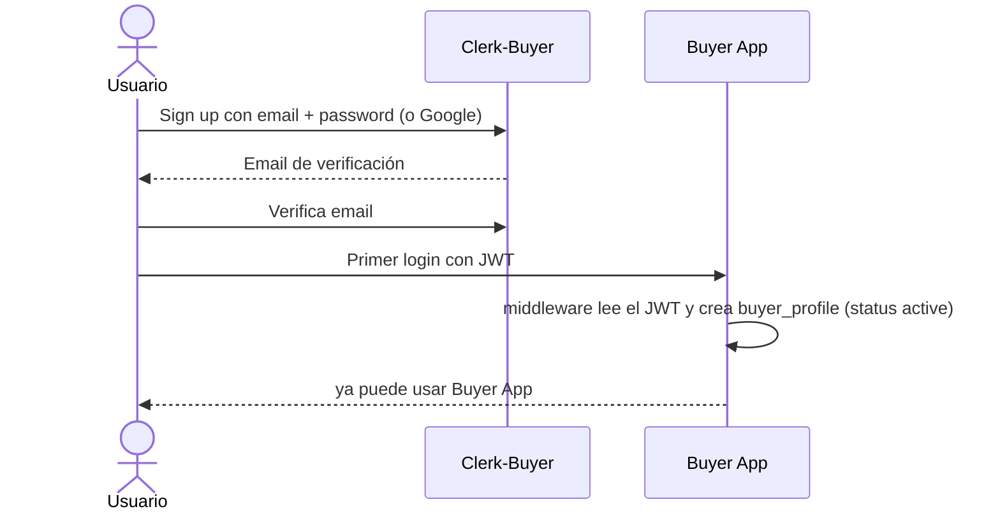
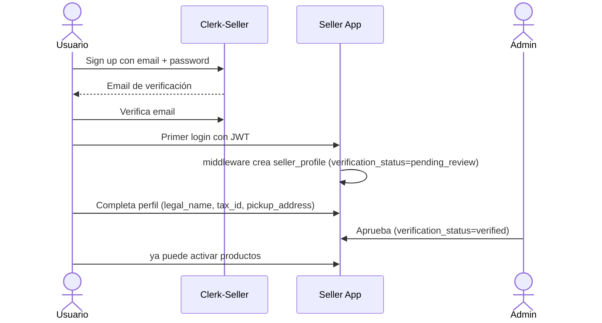
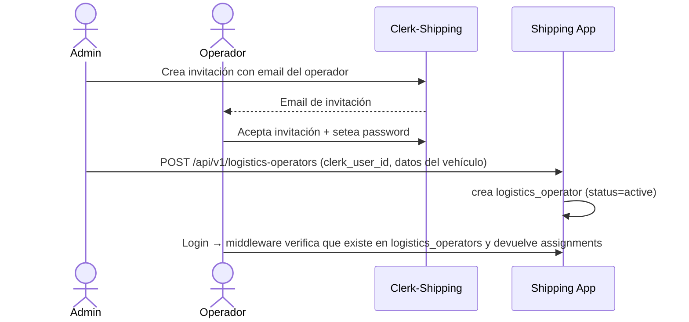
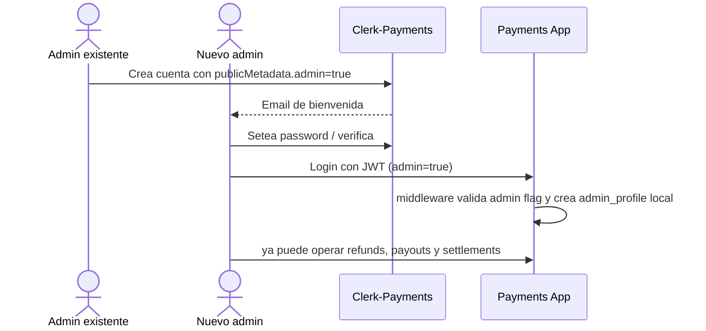

# 1.5 — Usuarios

> **Tipo C — Marketplace · BiciMarket**

---

## 1. Mapa de Clerks

| App | Clerk app name | Rol funcional | Quién se registra | Audiencia del JWT |
|---|---|---|---|---|
| Buyer App | `buyer.bicimarket` | `buyer` (implícito por estar en este Clerk) | Cualquiera que quiera comprar | `bicimarket-buyer-api` |
| Seller App | `seller.bicimarket` | `seller` | Vendedores aprobados (admin pasa de `pending_review` a `verified`) | `bicimarket-seller-api` |
| Shipping App | `shipping.bicimarket` | `logistics` | Operadores logísticos invitados por admin | `bicimarket-shipping-api` |
| Payments App | `payments.bicimarket` | `admin` (obligatorio) | **Solo admins del marketplace** (refunds manuales, payouts, settlements). Buyers y sellers nunca se loguean acá. | `bicimarket-payments-api` |

> Cada Clerk emite JWT con un `aud` (audience) propio. Las apps validan que el token sea de **su** Clerk, nunca de otro. Si Buyer App recibe un JWT firmado por Clerk-Seller, lo rechaza.

> **Sin identidad cruzada entre Clerks.** Cada Clerk es una base de usuarios independiente. Si un humano opera en varias apps, tiene cuentas separadas, una por Clerk; no se correlacionan entre sí. Las vistas que en otra arquitectura habrían vivido en una app "Payments para usuarios" (mis comprobantes, mis liquidaciones) viven dentro de las apps fuente: Buyer App muestra "Mis comprobantes" consumiendo Payments por REST; Seller App muestra "Mis liquidaciones" igual.

---

## 2. Asignación de rol `admin`

Hay un rol transversal: `admin`. Como no queremos un quinto Clerk admin, **cada Clerk de usuarios finales soporta `publicMetadata.admin: true`** para el reducido grupo de admins del marketplace. Estos humanos típicamente tienen cuenta en varios Clerks con la flag prendida.

| Clerk | Cómo se marca un admin | Endpoint donde aplica |
|---|---|---|
| `buyer.bicimarket` | `publicMetadata.admin = true` | Acceso a `GET /admin/orders`, etc. |
| `seller.bicimarket` | `publicMetadata.admin = true` | Endpoints admin de Seller (verifs, etc.). |
| `shipping.bicimarket` | `publicMetadata.admin = true` | Reasignaciones, cambio manual de status, alta de operadores. |
| `payments.bicimarket` | **No aplica como flag opcional**: todo usuario de Clerk-Payments es admin por definición. La app rechaza JWT sin `publicMetadata.admin=true`. | Refunds manuales, payouts manuales, cierre de settlements. |

Promoción a admin: la hace un admin existente vía Clerk Dashboard. Sin self-service.

---

## 3. Sincronización Clerk → DB local (provisioning perezoso, sin webhooks)

> **Decisión del proyecto**: no usamos webhooks de Clerk. Cada app sincroniza su perfil local **al momento del login**, leyendo el JWT validado y haciendo upsert en su DB. Es un trade-off conocido: los cambios hechos en Clerk Dashboard solo se reflejan cuando el usuario vuelve a loguearse, pero a cambio nos ahorramos un endpoint público con firma y todo el manejo de retry.

### 3.1 Cómo funciona

En el middleware de auth de cada app, antes de pasarle el request al controller:

1. Validar el JWT de Clerk → obtener `clerk_user_id`, `email`, `full_name`.
2. Buscar el perfil local por `clerk_user_id`.
3. Si no existe → crear (con los defaults que correspondan a la app).
4. Si existe pero `email` o `full_name` cambiaron respecto del JWT → actualizar el snapshot.
5. Continuar con el request normal.

Esto se hace en cada request, pero el costo es despreciable porque solo es un `SELECT` por `clerk_user_id` (índice único). Solo escribe cuando hay cambios reales.

### 3.2 Defaults al crear perfil

| App | Acción al primer login |
|---|---|
| Buyer | crea `buyer_profile` con `clerk_user_id`, `email`, `full_name`. Entra directo (no aplica `verification_status`). |
| Seller | crea `seller_profile` con `verification_status=pending_review`. No puede activar productos hasta que un admin lo apruebe. |
| Shipping | **no crea automáticamente**. Si el `clerk_user_id` no figura en `logistics_operators`, devuelve 403. Los operadores se crean por admin con `POST /api/v1/logistics-operators`. |
| Payments | crea `admin_profile` local en su DB **solo si** el JWT trae `publicMetadata.admin=true`. Sin flag admin, devuelve 403 y no crea nada. |

### 3.3 Soft delete

Cuando se borra una cuenta en Clerk, no nos enteramos automáticamente. Si hace falta, el admin elimina el perfil local manualmente, o se puede correr un cron diario que pregunte a la API de Clerk por `clerk_user_id`s que ya no existen y los soft-deletea. Para Etapa 1 basta con la limpieza manual.

---

## 4. Claims del JWT por app

Cada Clerk emite tokens con la siguiente forma. Las apps validan los claims indicados.

| App | Claims requeridos | Validación |
|---|---|---|
| Buyer | `sub` (clerk_user_id), `email`, `email_verified=true` | Token firmado por Clerk-Buyer (`iss=https://clerk.buyer.bicimarket.com`), `aud=bicimarket-buyer-api`. |
| Seller | mismos | Token de Clerk-Seller. Además: el `seller_profile` asociado debe estar `verified` (chequeo en backend). |
| Shipping | mismos | Token de Clerk-Shipping. El `logistics_operator` asociado debe estar `active`. |
| Payments | mismos + `publicMetadata.admin=true` | Token de Clerk-Payments. Sin flag admin, 401. No hay endpoints públicos para buyers/sellers en Payments. |

Operaciones `admin` en Buyer/Seller/Shipping requieren además `publicMetadata.admin === true` en el JWT del Clerk correspondiente.

---

## 5. Estrategia de roles

### 5.1 Reglas

1. **El rol funcional es implícito por el Clerk**. Si entrás con JWT de Clerk-Seller, sos seller. No hay "agregar/quitar rol".
2. **Un humano = N cuentas Clerk** (una por app donde quiera operar). Mismo email recomendado pero **no obligatorio** — el sistema no correlaciona identidades entre Clerks.
3. **`admin` es transversal** y vive en `publicMetadata.admin` en cada Clerk donde corresponda. En Clerk-Payments es obligatoria.
4. **El alta de seller no es libre**: el `seller_profile` se crea como `pending_review` y solo un admin lo pasa a `verified`. Hasta entonces, no puede activar productos.
5. **El alta de operador logístico tampoco es libre**: requiere invitación de un admin.
6. **Buyers y sellers no se loguean en Payments App.** Para ver comprobantes entran a Buyer App; para ver liquidaciones entran a Seller App. Esas apps consumen los datos de Payments por REST con `X-Service-Token`.

### 5.2 Flujo de alta — Comprador



### 5.3 Flujo de alta — Vendedor



### 5.4 Flujo de alta — Operador logístico



### 5.5 Flujo de alta — Admin de Payments



---

## 6. Variables de entorno por app

Cada app:

```env
# Clerk de la app
CLERK_PUBLISHABLE_KEY=pk_live_…
CLERK_SECRET_KEY=sk_live_…
CLERK_ISSUER=https://clerk.<app>.bicimarket.com
CLERK_AUDIENCE=bicimarket-<app>-api
```

No se comparten entre apps. Si una app necesita el `CLERK_SECRET_KEY` de otra, está mal — no debe.

---
