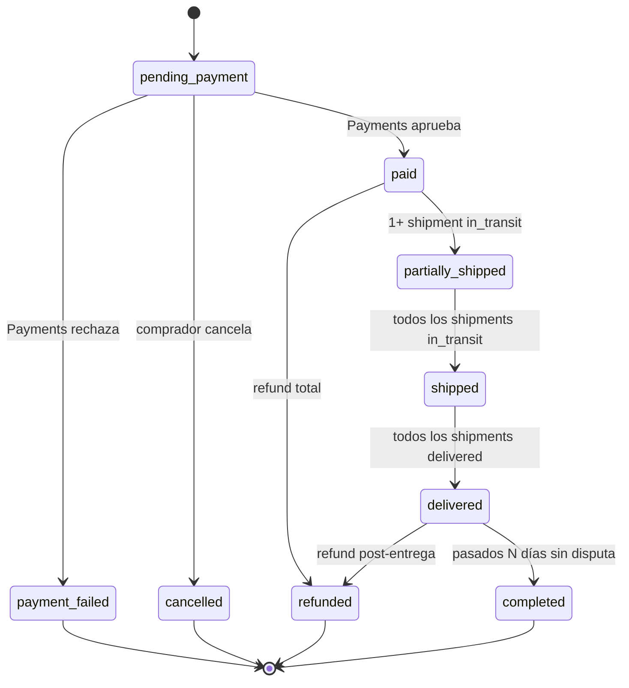
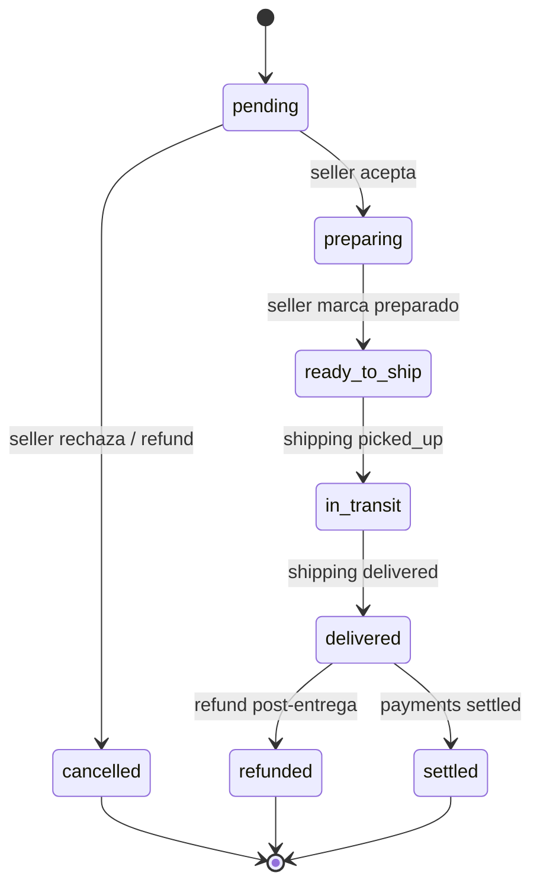
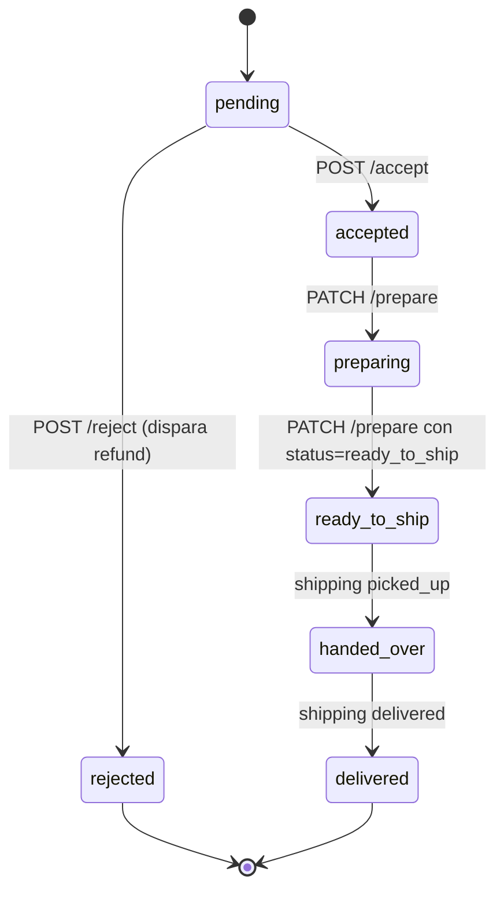
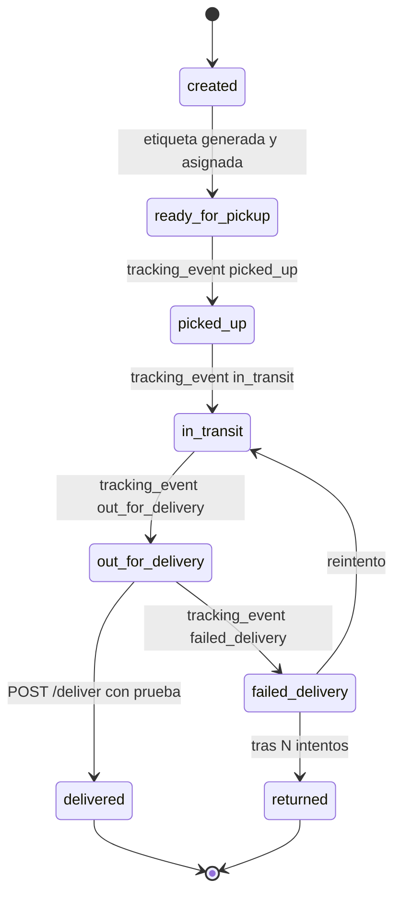
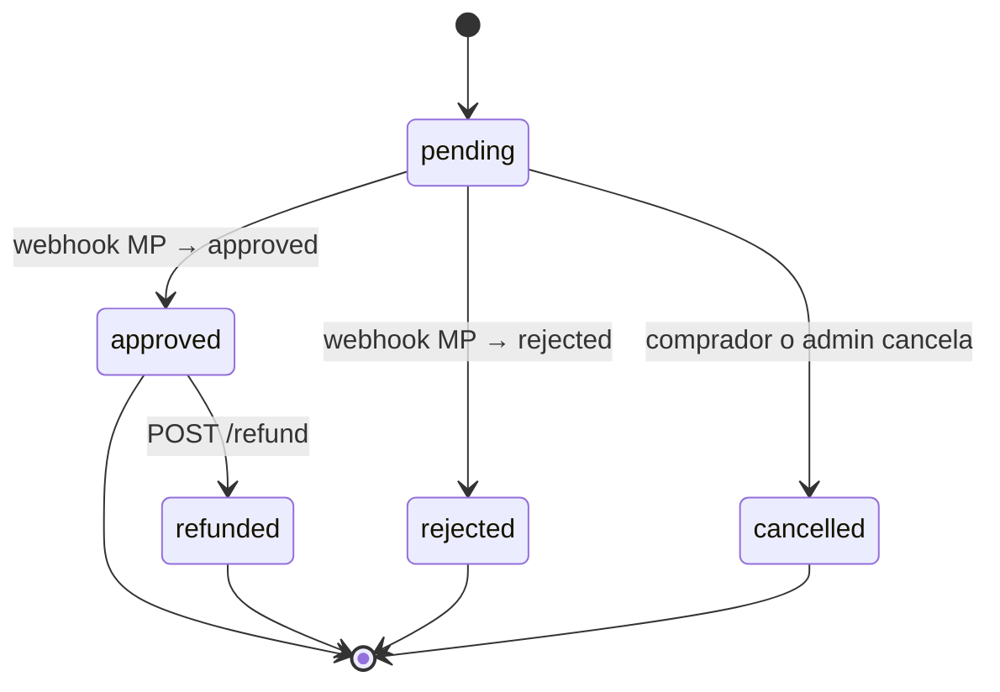
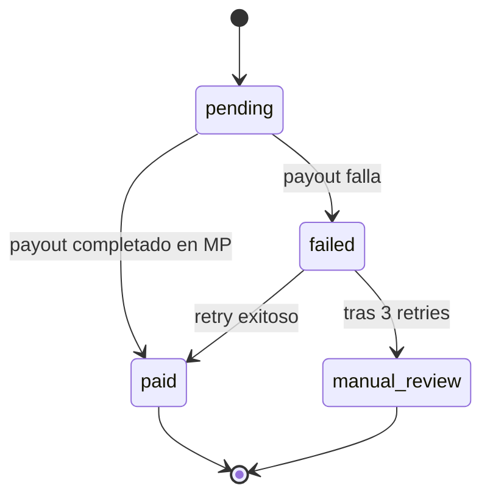
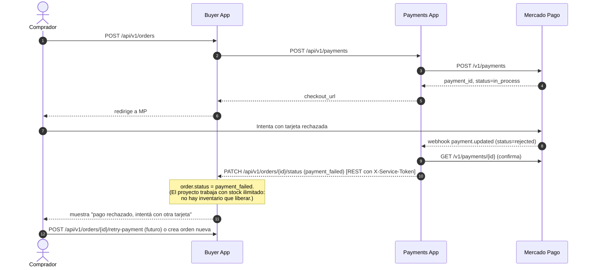
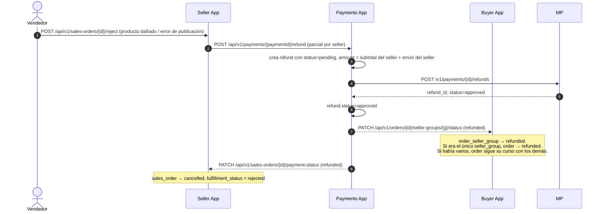
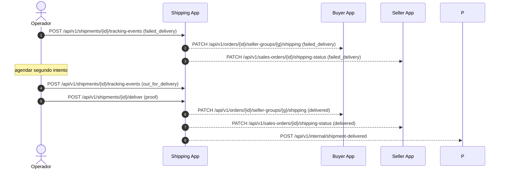

# 1.6 — Estados y Diagramas Adicionales (anexo)

> Anexo del `preview/`. Centraliza máquinas de estado, transiciones permitidas y diagramas de carril complementarios para casos no felices (rechazo, cancelación, devolución, fallo de pago).

> Documentación de referencia para los integrantes del equipo de desarrollo, no forma parte de la entrega.

> **Restricción del proyecto — stock ilimitado**: ningún diagrama contempla descuento, reserva ni liberación de stock. Toda publicación `active` se considera disponible. Los rechazos del vendedor en este anexo se atribuyen a otras causas (producto dañado, error de publicación, etc.). Ver `01-descripcion.md §1.1`.

---

## 1. Máquinas de estado

### 1.1 `order.status` (Buyer)

**Reglas**:

- `paid → partially_shipped` cuando ≥1 `order_seller_groups` están `in_transit` y al menos uno aún no.
- `partially_shipped → shipped` cuando **todos** los seller_groups están al menos `in_transit`.
- Una orden con un solo seller pasa directo de `paid` a `shipped` sin pasar por `partially_shipped`.

### 1.2 `order_seller_group.status`

### 1.3 `sales_order.fulfillment_status` (Seller)

### 1.4 `shipment.status` (Shipping)

### 1.5 `payment.status` (Payments)

### 1.6 `settlement.status` (Payments)

---

## 2. Diagrama de carril — caso de pago rechazado

---

## 3. Diagrama de carril — caso de rechazo del vendedor

---

## 4. Diagrama de carril — entrega fallida y reintento

Si el segundo intento también falla y se acumulan 3 intentos, el shipment pasa a `returned` y se dispara el flujo de reembolso.

---

## 5. Resumen de transiciones permitidas (rejection table)

Toda app que reciba un cambio de estado debe **rechazar transiciones inválidas con HTTP 409 INVALID_TRANSITION**. Esta tabla es la fuente de verdad:

### `order.status`

| from \ to         | paid | payment_failed | partially_shipped | shipped | delivered | completed | cancelled | refunded |
| ----------------- | ---- | -------------- | ----------------- | ------- | --------- | --------- | --------- | -------- |
| pending_payment   | ✅   | ✅             | ❌                | ❌      | ❌        | ❌        | ✅        | ❌       |
| paid              | ❌   | ❌             | ✅                | ✅      | ❌        | ❌        | ❌        | ✅       |
| partially_shipped | ❌   | ❌             | ❌                | ✅      | ❌        | ❌        | ❌        | ✅       |
| shipped           | ❌   | ❌             | ❌                | ❌      | ✅        | ❌        | ❌        | ✅       |
| delivered         | ❌   | ❌             | ❌                | ❌      | ❌        | ✅        | ❌        | ✅       |
| completed         | ❌   | ❌             | ❌                | ❌      | ❌        | ❌        | ❌        | ❌       |

### `payment.status`

| from \ to | approved | rejected | cancelled | refunded |
| --------- | -------- | -------- | --------- | -------- |
| pending   | ✅       | ✅       | ✅        | ❌       |
| approved  | ❌       | ❌       | ❌        | ✅       |

### `shipment.status`

| from \ to        | ready_for_pickup | picked_up | in_transit | out_for_delivery | delivered | failed_delivery | returned |
| ---------------- | ---------------- | --------- | ---------- | ---------------- | --------- | --------------- | -------- |
| created          | ✅               | ❌        | ❌         | ❌               | ❌        | ❌              | ❌       |
| ready_for_pickup | ❌               | ✅        | ❌         | ❌               | ❌        | ❌              | ❌       |
| picked_up        | ❌               | ❌        | ✅         | ❌               | ❌        | ❌              | ❌       |
| in_transit       | ❌               | ❌        | ❌         | ✅               | ✅        | ✅              | ❌       |
| out_for_delivery | ❌               | ❌        | ❌         | ❌               | ✅        | ✅              | ❌       |
| failed_delivery  | ❌               | ❌        | ✅         | ❌               | ❌        | ❌              | ✅       |
